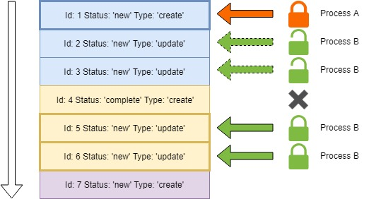

# Implementing a Distributed Lock State Machine
A complex distributed computing problem application developers may encounter is controlling access to a resource or entity in a multi-user, concurrent environment.  How can we guard against an arbitrary number of concurrent processes from potentially mutating or even having any access to an entity simultaneously?  One possible solution is to rely on database management systems which provide concurrency safeguards via ACID transactions and row-level locking.

In this article, you'll learn how I combined various technologies like Postgres, SQL and Node.js and created an application which implements a Distributed Lock State Machine.

In understanding the approaches taken here, you'll learn how commitment control, isolation levels, and ACID transaction guarantees can be applied to implement a distributed lock state machine.  In this context, "distributed" means multiple concurrent processes.  The "lock" is the safety mechanism that safeguards against concurrent processes from gaining access to shared resources or entities simultaneously.  Finally, "state machine" means those concurrent processes will have the ability to identify a resource or entity in a specific state (e.g. `new`, `in-progress`), perform some work or processing on them, and transition them to a final, settled state (e.g. `complete`, `error`).

At the end, I'll provide additional examples of the implementation that can be applied to achieve robust data aggregation and replication without requiring changes to your existing applications.

# An Example Use-Case
Recently, I've been working with applications that construct Google Sheets with user-driven data.  The spreadsheet link is given to the user and the users can update the contents of the worksheet followed by clicking a hyperlink to effectively "send back" the data to the server for processing.

Here is the gist of the setup:
* A "front-end" application, which is responsible for receiving and recording requests to either `create` or `update` a spreadsheet
* A "back-end" application that uses SQL and commitment control to locate, process, and finalize the outcome of the requests for future logging

Each application is independently scalable and run in a distributed cloud computing environment.

The two components communicate via a "hand-off plane", which is an SQL table.  Additionally, a simple, event-driven notification system is employed via two SQL statements issued against the Postgres server.

Here is a high-level overview of how the components interact:


# Creating the Hand-off Plane
When a user requests a spreadsheet to be `created` or `updated`, a REST call is made to the "front-end" application, which is ultimately a Node.js Express server.  The Express server then (in addition to validation, JWT authentication, etc) creates an entry in an SQL table.  The newly created row contains the sufficient information to be acted upon later.

This SQL table has a couple key columns which are important in understanding the state machine implementation.

The first state variable is `request_status`.  This is simply a `TEXT` column in a Postgres table that could be any of the following four values:

* `new`
* `in-progress`
* `complete`
* `error`

All rows written to the table would have a default `request_status` of `new`.  As the requests are chosen (more to come), the row is updated to `in-progress`.  Upon completion of the request, the row would then settle to the value of either `complete` or `error`, depending on the outcome.

The second state variable is `process_id`.  This is also a `TEXT` column and would represent the "identity" of the process responsible for implementing the request.  This value ultimately is a UUID, generated at run-time for each request being processed (more to come on that as well).

There are additional columns such as the URL to the spreadsheet, the identity of spreadsheet, the type of request (create/update), and various other relevant pieces of information.  The two state variables described previously are ubiquitous for any process that follows this pattern.

```sql
CREATE SEQUENCE spreadsheets.request_queue_id_seq;

CREATE TABLE spreadsheets.request_queue (
  request_queue_id BIGINT NOT NULL PRIMARY KEY DEFAULT NEXTVAL('spreadsheets.request_queue_id_seq'),
  request_status TEXT NOT NULL DEFAULT 'new',
  request_type TEXT NOT NULL DEFAULT 'create',
  process_id TEXT,
  spreadsheet_id TEXT NOT NULL,
  CONSTRAINT CHECK (
    request_status IN (
      'complete',
      'error',
      'in-progress',
      'new'
    )
  ),
  CONSTRAINT CHECK (
    request_type IN (
      'create',
      'update'
    )
  )
);

CREATE UNIQUE INDEX request_queue_01
ON spreadsheets.request_queue (
  spreadsheet_id, request_type
)
WHERE (
  request_type = 'create'
);
```

The constraints above provide some basic data integrity at the database layer.  Additionally, the sparse unique index ensures that only one `create` request can exist for any one spreadsheet.

# Communication Channel
The "front-end" application is be able to receive any number of concurrent requests to either `create` or `update` a spreadsheet.  For each such request, it then executes an `INSERT` statement to create a row in the SQL table described above, where the request (by default) is in `new` status.

```sql
INSERT INTO spreadsheets.request_queue (
  request_type,
  spreadsheet_id
)
VALUES (
  'create', -- could be 'update' also
  '9s9has9d81hd0a0891h0d90a881840f' -- the identity of the google spreadsheet
);
```

In addition, the "front-end" executes a `NOTIFY` statement to "awaken" the "back-end" application, causing it to start searching for work.

```sql
NOTIFY spreadsheets_request_queue;
```

The "back-end" application is idle throughout the day until a user requests a spreadsheet to be created or updated.  When this occurs, a row is written to the SQL table.  The "back-end" application is made aware of the new row by having executed a `LISTEN` statement on the same topic as used by the `NOTIFY` statement.

This is a simplistic mechanism to implement an asynchronous communication channel between the "front-end" and "back-end" applications.  The channel name can be a string of your choosing, with some limitations regarding white space and special characters.  No additional setup is needed to create a channel.

It is important to note that only currently connected clients which are already listening for a message to appear on the topic will receive that notification.  At first blush, you may think that some information is lost if the "back-end" is offline.  As you'll come to find out this simplistic, asynchronous, lossy communication channel is perfectly suited for this event-driven design.

# Priming the Pump
The "back-end" application is designed to run independently of the "front-end" application.  It can be offline indefinitely.  This means that even if the requests are not being processed because the "back-end" is not running, requests to be processed are still being captured by the "front-end" application.  While it will appear that the system is not responsive during the outage, no requests will be lost.

As and when the "back-end" application starts, one of the first things the "back-end" application does is execute the `LISTEN` statement and create an event listener.  Using the `pg` module, this is easily done with the `on` method of the client which is consistently connected to the Postgres database where the SQL table lives.

```javascript
const { Client } = require('pg');
const client = new Client();

// setup event listener
client.on('notification', async () => { ... });

// begin listening for notifications on the communication channel
client.query('LISTEN spreadsheets_request_queue');
```

From that point on, the "back-end" application will receive any new notifications created by way of the `NOTIFY` statement executed by the "front-end" application.  But what if the "back-end" application has been offline for some time, you ask?

In addition to executing the `LISTEN` statement to receive any new notifications, the "back-end" application effectively perform a self-notification by executing the `NOTIFY` statement _itself_.  This causes the "back-end" to believe that some work is needing to be done and it starts searching for work immediately.

```javascript
// prime the pump
client.query('NOTIFY spreadsheets_request_queue');
```

# Commitment Control
To ensure database integrity, the "back-end" application uses commitment control.  This allows the application to update rows without immediately making the changes permanent and also locks the rows to the application process.

To implement commitment control, the "back-end" application executes the `BEGIN` statement and uses `COMMIT` and `ROLLBACK` as needed, depending on the outcome of various actions.

```sql
BEGIN; -- start commitment control
COMMIT; -- make changes permanent
ROLLBACK; -- undo any pending changes
```

Using commitment control also means that if the "back-end" application dies suddenly for any reason (server outage, unexpected run time error, out of memory condition, etc), uncommitted changes will also be _automatically_ rolled-back by the database manager.  This assures there will never be a row caught in a zombie-like state where it is always `in-progress`.  Any row which was once `new` will always settle to `complete` or `error`, depending on the outcome.  If any unexpected error occurs, any row which was _temporarily_ transitioned to `in-progress` will assuredly be reverted to its original `new` state.

This does mean the application must be willing and able to tolerate the possibility that a spreadsheet was _partially_ created or updated.  This is not an inherent flaw in this distributed lock state machine; it is just a consequence that `googleapis` calls and spreadsheet interactions are not also under commitment control.  In later sections, you'll learn how when combined with your existing database tables, the distributed lock state machine implementation also cleanly handles and corrects partial transactions.

# Searching for Work
When the "back-end" application is awakened by a notification that some new request is ready to be processed, it first generates a process identifier that is unique against all other parallel processes.  This can be achieved in a number of ways.

A simple, distributed approach is to create a UUID, which can give you a _theoretically_ globally unique value in a distributed computing environment.  In this example, I used the popular npm package `uuid` and the specific `v4` implementation.

```javascript
const uuid = require('uuid/v4');
const processId = uuid();
```

**Note**
There is a caveat to this approach.  It is entirely possible, although statistically impossible that two UUIDs can ever be created.  If this is a concern, another approach to obtain a truly unique identifier is through a sequence object in the database itself.  However, that has the drawback of additional database calls, entities, and permissions.

Once the process identifier is generated, the "back-end" application executes a searched `UPDATE` statement.  In this searched update, the "back-end" application is looking for the _first_ request in `new` status (which it has not already seen before- more to come).

Since the table also has a system-generated, ever-increasing unique identifier, the order of the rows is easily controlled.  By ordering on the request identifier, the application processes the requests in FIFO order.

```sql
UPDATE spreadsheets.request_queue
SET
  process_id = $1, -- that UUID
  request_status = 'in-progress'
WHERE (request_queue_id) = (
  SELECT
    request_queue_id
  FROM spreadsheets.request_queue
  WHERE (
    request_status = 'new'
    AND request_queue_id > $2 -- see note below
  )
  ORDER BY
    request_queue_id
  FETCH FIRST ROW ONLY
  FOR UPDATE SKIP LOCKED
)
RETURNING
  request_queue_id,
  request_type,
  spreadsheet_id;
```

This statement has two critically important concepts that need to be understood.

First, the clauses:
* `FETCH FIRST ROW ONLY` - return only the first row that meets the criteria
* `FOR UPDATE SKIP LOCKED` - tell the database manager that the row will be updated **and** skip any rows which are currently locked to any other process

Next, the "line-in-the-sand":
* `WHERE request_queue_id > $2` - skip any rows where the unique identifier is less than the value provided

At application start-up the "line-in-the-sand" is the value `0`.  The table is setup such that the system-generated identity values begin at the value `1` and increase as each row is written to the table.  This will become more clear next.

Recall that commitment control is in effect, so this row which is found and updated is only temporarily updated (not yet permanent) **and** it is _locked_ to the process which updated the row.  This ensures that no other process can update the row until the changes are either committed or the transaction is rolled-back.

# Validation and Grouping Requests
The searched-update statement above will blindly update any row that meets the criteria.  This means that the `request_type` could be either `create` or `update`.  Depending on the outcome, the "back-end" application performs additional validations and grouping.

---

## Handling `create` Requests
If the type of request is to `create`, the "back-end" application can proceed with creating the spreadsheet.  However, if the type of request is to `update` then two additional actions are taken.

---

## Handling `update` Requests
To be able to `update` a spreadsheet, the previous `create` request must already be completed.  This is verified using the following `SELECT` statement:

```sql
SELECT true
FROM spreadsheets.request_queue
WHERE (
  spreadsheet_id = $1 -- the identity of the spreadsheet discovered in UPDATE
  AND request_type = 'create'
  AND request_status NOT IN ('complete', 'error')
)
FOR UPDATE NOWAIT;
```

Examining the clause:
* `FOR UPDATE NOWAIT` - do not wait if the row is locked

This statement will throw an exception (SQL State `55P03`) if the `create` request for the same `spreadsheet_id` is locked to another process.  This means that the `create` is still being worked on by a parallel process!  When this occurs, the "back-end" application rolls-back the prior `UPDATE` and **skips** the row.

```sql
ROLLBACK;
```

The `ROLLBACK` statement resets the state of the previously updated row to `new` so it may be worked on again in the future.  Additionally, the "line-in-the-sand" value alluded to earlier is updated to the identity of the row the "back-end" application already looked at.

The "back-end" application still must guard against updating a spreadsheet that is already being updated by another process.  If two separate instances of the application were to update the same spreadsheet at the same time, the results would be unpredictable.

In the case of an `update` request, the "back-end" application prefers to "group-up" all outstanding update requests for the same spreadsheet.  This is done to account for the scenario where a user might repeatedly click the update request and generate potentially dozens or more update requests.  Ultimately, all outstanding requests to update will be considered a single request to update.

To accomplish this, another searched-update is performed:

```sql
UPDATE spreadsheets.request_queue
SET
  processor_id = $1, -- the same UUID assigned to the process
  request_status = 'in-progress'
WHERE (
  request_queue_id IN (
    SELECT
      request_queue_id
    FROM spreadsheets.request_queue
    WHERE (
      spreadsheet_id = $2 -- the identity of the spreadsheet discovered in UPDATE
      AND request_type = 'update'
      AND request_status NOT IN ('complete', 'error')
    )
    FOR UPDATE NOWAIT
  )
);
```

In the above `UPDATE` statement, all the outstanding `update` requests for the same spreadsheet found to be worked on will be _allocated_ to the same processor id (UUID).

As before, the `FOR UPDATE NOWAIT` clause will cause the statement to fail if there is a conflict.  This will occur if there is a concurrent instance of the "back-end" application already updating the spreadsheet.

If this statement fails, then as before a `ROLLBACK` will occur and the "line-in-the-sand" will be set to the identity of the request found previously.

# Progressing Through the Requests
If the transaction is not rolled-back, then the "back-end" application has successfully allocated either a single `create` request or one or many `update` requests of the same spreadsheet id.  The spreadsheet is then created or updated accordingly.

Upon completion of the create or update, the request row(s) are updated one more time to indicate the outcome of the operation.

```sql
UPDATE spreadsheets.request_queue
SET
  request_status = 'complete' -- or 'error', if there is one
WHERE (
  process_id = $1 -- the same UUID assigned to the process
);
```

The above searched `UPDATE` statement will update all the request(s) that were previously locked to the process by the identity generated at run-time.  This will either be the single `create` request or one or many `update` requests to the same spreadsheet.

At this point, the "back-end" application can safely commit its changes.

```sql
COMMIT;
```

The "back-end" application iterates through the data by beginning again with a search for the _first_ outstanding `new` request but this time the search begins _after_ the `request_queue_id` found previously.

This process continues until no more rows are returned by the search, or if all the candidate rows need to be skipped due to concurrent processes as described above.

# Dealing with Concurrency
What happens if there are rows skipped?  How will the "back-end" application be assured everything gets processed if it is intentionally skipping requests?

To handle this, the "back-end" application makes the assumption that if _any_ request to `create` or `update` is found and processed, then it is _possible_ another concurrent processor was forced to skip a row that should have been processed.

Thus, the "back-end" application iterates until no more rows are returned by the search **and** no work is actually performed.  After each complete turn of looking through the request table, the "line-in-the-sand" state variable will reset to its initial value of `0` and if any rows were locked in the prior iteration, all possible rows which are in `new` status will be again examined.

Only when the "back-end" application finds zero rows in `new` status will it enter an idle state.  At which time, it will wait once more for the `NOTIFY` statement to be executed by the "front-end" application when a user makes a new request to either `create` or `update` a spreadsheet.

# Detailed Explanation Example
Let's now visualize with an example of how the flow works.  Consider the following image:



The arrow on the left is the order in which rows will be found by way of the `ORDER BY` clause, specified in the searched-update.

Assume that each horizontal, colored box represents an entry in the request_queue table.  Each color also represents a request corresponding to a single spreadsheet.  For example, the first three boxes represent a `create` and two `update` requests to the same spreadsheet.

If `Process A` and `Process B` are two arbitrary instances of the "back-end" application running, then the lock icons you see depict what rows will be processed by the respective instances.

In the example, `Process A` is awakened by a `NOTIFY` statement from the "front-end".  It locates the _first_ row where the `request_status` is `new`.  This is the first row in the table.

That row is updated to `in-progress` and is locked to `Process A`.

Similarly, `Process B` is awakened by a `NOTIFY` statement, or perhaps it just happens to come online after some requests are already present in the table.  When it awakens, it too will find the _first_ row where the `request_status` is `new`.  Since `Process A` has already locked the first row, the first row is skipped and it finds the second row.

The second row in the table is an `update` request for the same spreadsheet that `Process A` is working on.  When `Process B` gets the `update` request, it checks whether the `create` request for the same spreadsheet is complete.

In this example, that is not the case since `Process A` is still running.  As a result, `Process B` receives a row-lock exception identified with SQL state `55P03`.  Thus, `Process B` performs a `ROLLBACK` statement and advances its "line-in-the-sand" to identity `2`, the first row it found to work on.  `Process B` then iterates and finds the next row, identity `3`.

Again, in this example, `Process A` is still in the process of creating the spreadsheet, so again `Process B` must abort trying to `update` the spreadsheet since it receives a row-lock exception when trying to validate the `create` request is completed.  The "line-in-the-sand" for `Process B` advances to identity `3`.

On the next iteration for `Process B`, it skips identity `4` because it is already `complete`.  It then discovers and locks identity `5` and determines it to be an `update` request.  `Process B` successfully validates the `create` request is complete and also successfully identifies and locks all the related `update` requests for the same spreadsheet.  All the outstanding `update` requests are allocated to `Process B` by performing the searched-update to update the status for all related spreadsheet identities.

Since both `Process A` and `Process B` found work, they _assume_ they _probably_ blocked another process from performing work they have found.  So, both those processes will iterate through the remainder of the table by advancing with the "line-in-the-sand" concept until no more rows are found.  Since they assume some rows were probably skipped, they start again from the beginning and either `Process A` or `Process B` will find the skipped rows and process them.

# Additional Applications
There are a number of additional applications of this technique.  One such use-case is replication and aggregation.

In other settings, I have used this same approach to intercept changes to tables via SQL triggers, which would in much the same way record an event for later processing.  You could attach a trigger to an SQL table and have that trigger `INSERT` the row into the queue-like table on your behalf.

In doing so, you've achieved a number of important and desirable capabilities and guarantees:

* **100% guaranteed delivery.**  Regardless of the interface, be it an API or an ad-hoc SQL query, _any and all_ changes to the table(s) of interest will _always_ be intercepted and recorded.
* **Separation of concern.**  Applications should not necessarily understand that there is some behind-the-scenes aggregation or replication occurring.  By recording the changes in the database layer, the application layer is not made aware of this and can perform their functions without those concerns.  Additionally, by offloading the responsibility to the database layer, the application does not have an additional burden of notifying downstream systems of the changes.
* **No phantom changes.**  Since the trigger runs in-line with the originating transaction, if that transaction fails and therefore is rolled-back, so too is the log of the change.  Since rows that are not committed are also locked to the process which modifies them, the background processor will never read (because it cannot see) uncommitted changes.
* **Transactional boundary.**  Using commitment control, you can read a row from the queue-like table, perform your aggregation or replication and if _that_ fails you can `ROLLBACK` and keep your intercepted changes in a pristine state.
* **History Log.**  The queue of transactions need not necessarily be purged.  In doing so, your record of changes provides the knock-on benefit of providing a searchable history log.

One practical example is aggregating data from multiple disparate sources into a single source of truth.

In the past, I have used this technique to intercept changes to 17 different tables containing lots of different pieces of information regarding customer orders including addresses, names, phone numbers, ad-hoc warranty notes, items and item information, and so on.

Using the same technique described above, a queue-like table was developed and 17 SQL triggers were attached to the source tables, which in turn wrote to the table.  The applications which were updating these various tables were never made aware of these triggers and were also not impacted by the replication process.  Moreover, the applications that were updating those tables were quite old and monolithic in nature, so adding replication or message propagation logic to those legacy applications was neither feasible nor desirable.  Writing an additional row in-line with a transaction is very lightweight so the original applications were not burdened by the change.  The background process had the burden of understanding what to do with those changes.

The background process in this case read those entries from the history log and scraped all the relevant information about the customer order and created entries in another table which provided a massively powerful capability to search against bits of data about the order.  The net result was a Google-like query engine, searching against 2 billion rows of textual data that gave the business the ability to find any order of interest in a sub-second.  Prior to this new system, the business literally would spend hours and even days trying to find just one order so that warranty information could be located and appropriate customer interaction taken.

# Upcoming Article
In an upcoming article, I'll dive deep into how I built the Google Spreadsheets, exploring the `googleapis` npm module and devising solutions to adhere to rate limited quotas through request batching.
